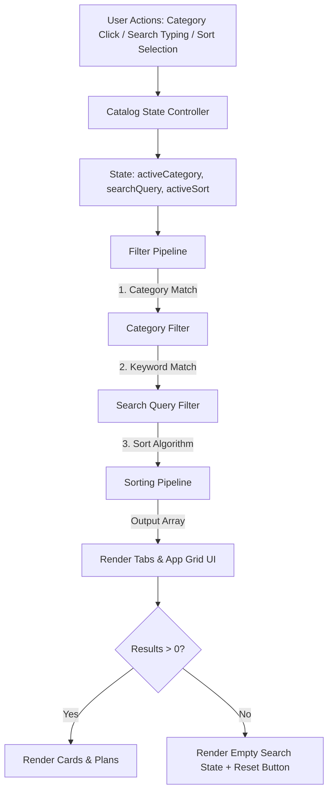

# Architecture Blueprint: Category Filters, Smart Sorting Engine, & UI Modernization

## 1. Architectural Data Flow



---

## 2. Component Design & Contracts

### 1. Data Schema Enhancements (`script.js`)
```javascript
{
    id: "netflix",
    name: "Netflix",
    category: "streaming", // "streaming" | "design" | "music" | "productivity"
    popularityScore: 100,
    icon: "fa-solid fa-play",
    color: "#E50914",
    plans: [ ... ]
}
```

### 2. State & Pipeline Functions
- `activeCategory` (default: `'all'`)
- `searchQuery` (default: `''`)
- `activeSort` (default: `'popular'`)
- `getMinPrice(app)`: Helper menghitung harga terendah dari seluruh durasi paket suatu aplikasi.
- `getFilteredAndSortedApps()`: Pipeline terpadu yang memfilter kategori, mencocokkan kata kunci, dan menyortir aplikasi.
- `renderCategoryPills()`: Merender filter bar pill dengan counter jumlah produk per kategori.

---

## 3. UI Modernization Blueprint (`index.html` & `styles.css`)
1. **Hero Section**: Styling premium sesuai gambar referensi dengan badge berdenyut (*pulse badge*), tipografi bersih, dan kartu cara kerja 3 langkah.
2. **Category Tabs Bar**: Bar pill horizontal yang responsif (dapat digulir di layar ponsel/touch-friendly) dengan status aktif modern.
3. **Integrated Search & Sort Toolbar**: Bar kontrol terpadu yang menggabungkan input pencarian dan dropdown sortir harga.
